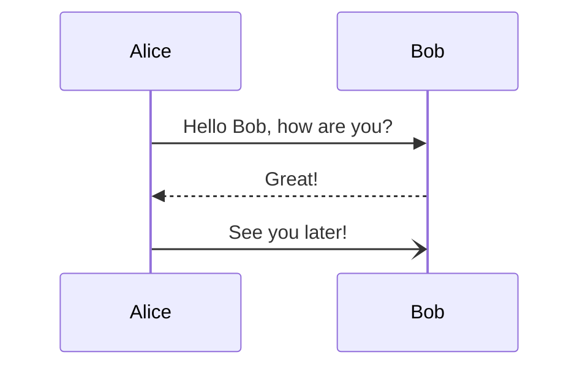

# Overview

(This page is a work in progress)


[//]: # (This is a comment. Follow this format for comments.)


#### Code Blocks
[//]: # (code block)

```sh
git clone git@github.com:SentinelVote/website.git
```

#### Mermaid: sequenceDiagram
[//]: # (diagrams)



#### Links
[//]: # (links)

[hello](https://example.com)

#### Quotations
[//]: # (quotations)

> Quotations \
> Multi-line quotations
>> Nested quotations

#### Regular Text
[//]: # (regular text)

Regular text
\
breakline, same paragraph
