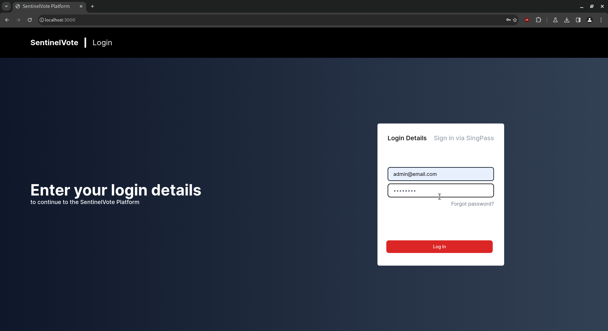
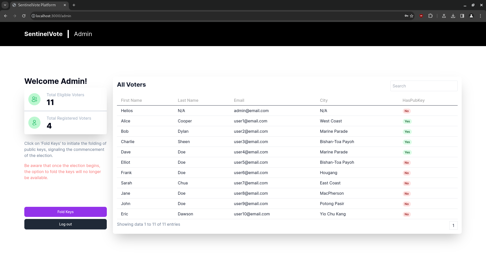
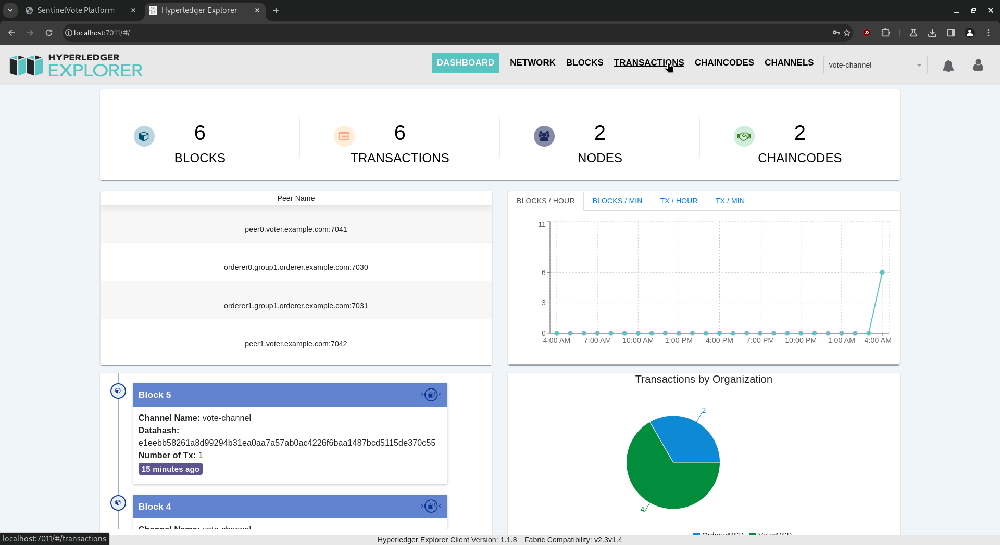
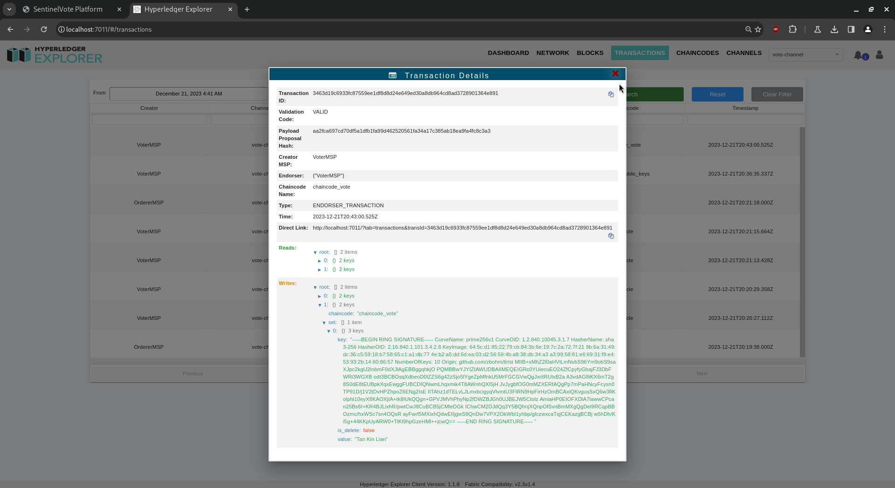
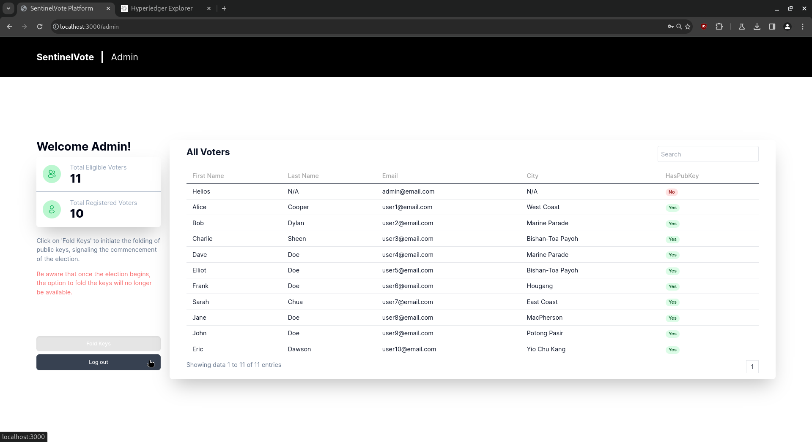

# Central Authority

## User Manual for Central Authority

### Registration/Setup Phase Actions

**1. Login as Admin**

Enter the admin’s credentials to login:

**2. Home Page**

The home page shows the list of users and their status. On the bottom left, a purple button “Fold Keys” should be clicked once all voters have generated their public key or the cutoff time for the voters to do so has passed:

When all voters have generated their public key, the admin is ready to click “Fold Keys.” Before that, compare the number of blockchain transactions:

**3. Hyperledger Explorer**

Enter the admin’s credentials to login:

**4. Explorer Dashboard**

The dashboard displays information on the blockchain network:

**5. Explorer Transactions**

Note the total transactions, which is originally 6:

**6. Home Page - Fold Keys**

Click on “Fold Keys.” This process is irreversible:

**7. Explorer Transactions - Fold Keys**

Note the total transactions, which is now 7:

**8. Explorer Single Transaction - Fold Keys**

Open and read the newest transaction. The folded public keys (linkable ring signature group) are stored in the blockchain:

Concurrently, the folded public keys are also stored in the Central Authority’s database.

### Voting Phase Actions

**1. Explorer Single Transaction - Vote Cast**

A vote was cast. Open the newest transaction:

**2. Explorer Single Transaction - Vote Cast**

See an LRS signature with the cast vote:

**3. Logout**

After the election is completed, click “Log out” to safely log out:

