# Central Authority

## User Manual for Central Authority

### 1. Actions performed on the registration/setup phase.

**Login.**
Enter the admin’s credentials to login as admin:
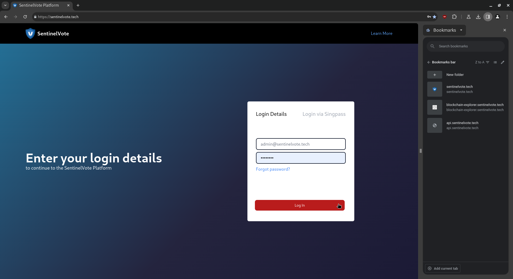

**Home Page.**
The home page shows the list of users and their status: On the bottom left, a purple but-ton “Fold Keys” should be clicked once all voters have generated their public key, or the cutoff time for the voters to do so has passed:
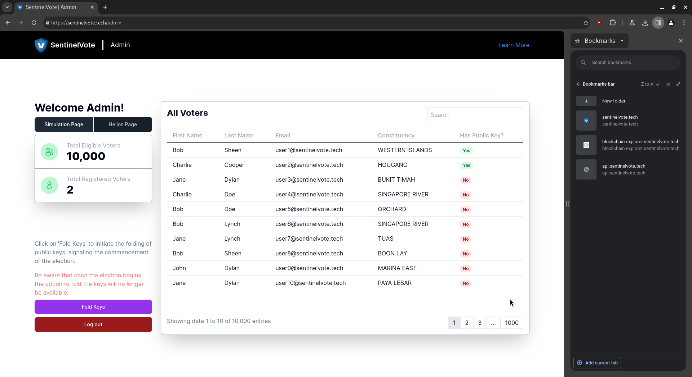
When all voters have generated their public key, the admin is ready to click “Fold Keys.” Before that, compare the number of blockchain transactions:

**Hyperledger Explorer:**
Enter the admin’s credentials to login:
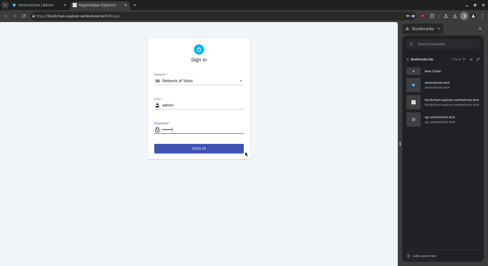

**Explorer Dashboard.**
The dashboard displays information on the blockchain network:
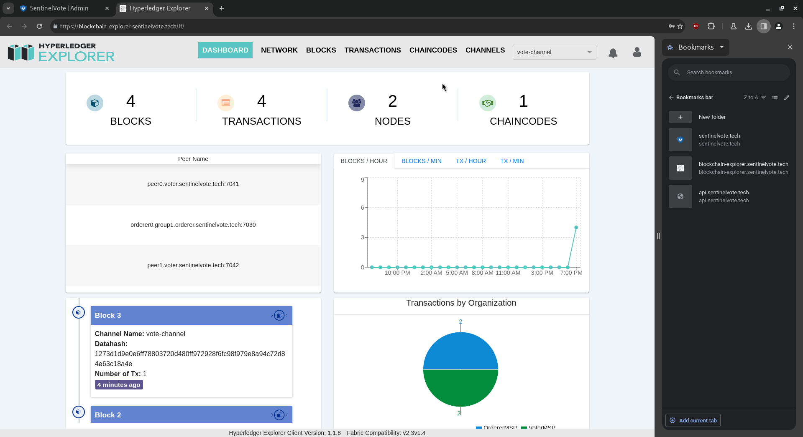

**Explorer Transactions.**
We note the total transactions, which is originally 4:
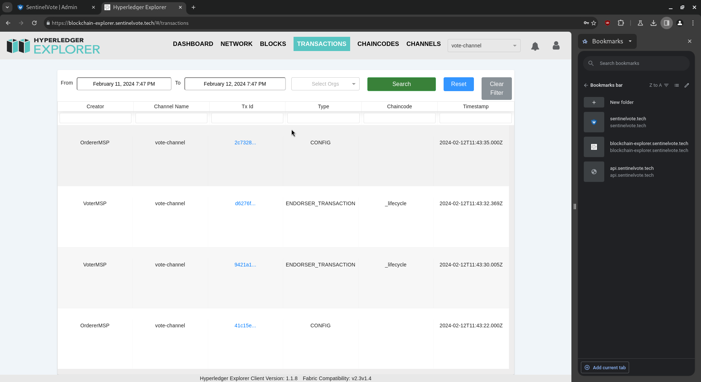

**Home Page.**
We click on “Fold Keys”. This process is irreversible:

**Explorer Transactions.**
We note the total transactions, which is now 5:
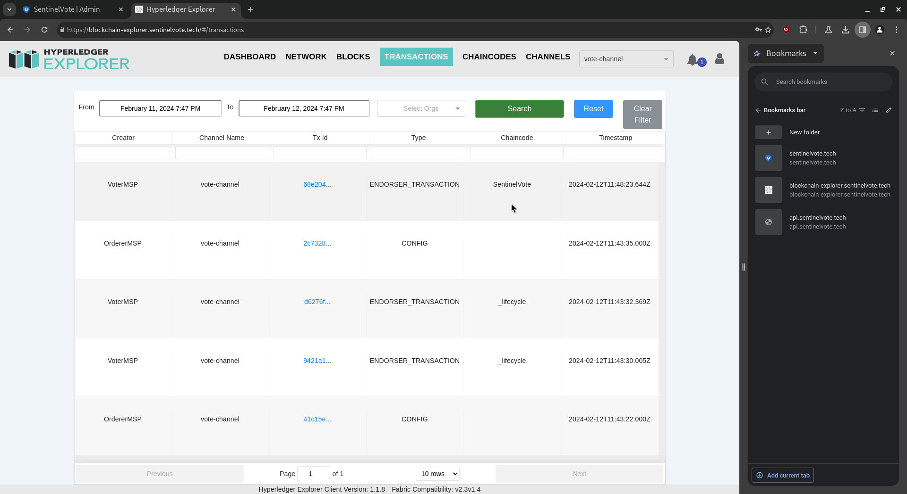

**Explorer Single Transaction.**
We open and read the newest transaction. The folded public keys (also called the linkable ring signature group) is stored in the blockchain:

### 2. Actions performed on the voting phase.

**Helios.**
The Helios platform will be accessible once the voting phase has started. We note the total votes, which is originally 0:
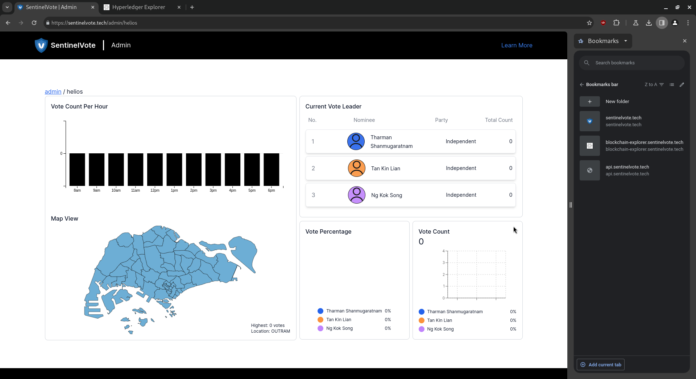

**Explorer Single Transaction.**
A vote was cast. We open the newest transaction:
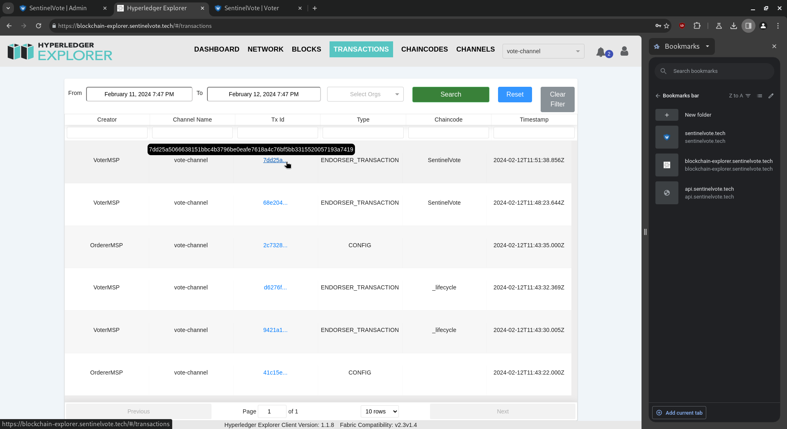

**Explorer Single Transaction.**
We see an LRS signature with a vote that was cast:
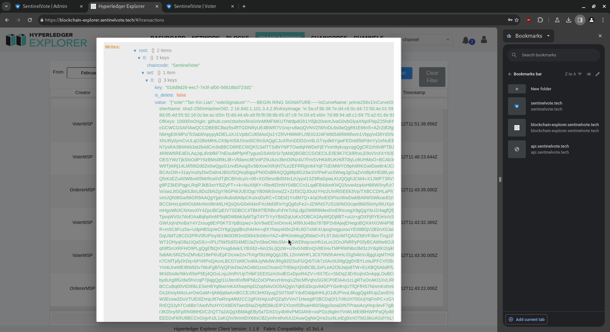
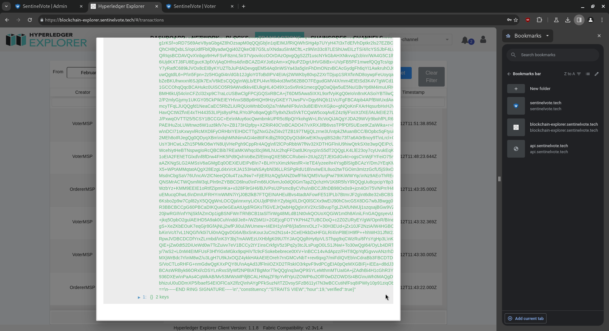

**Helios.**
Back on the Helios platform, we note the total votes, which is now 1:
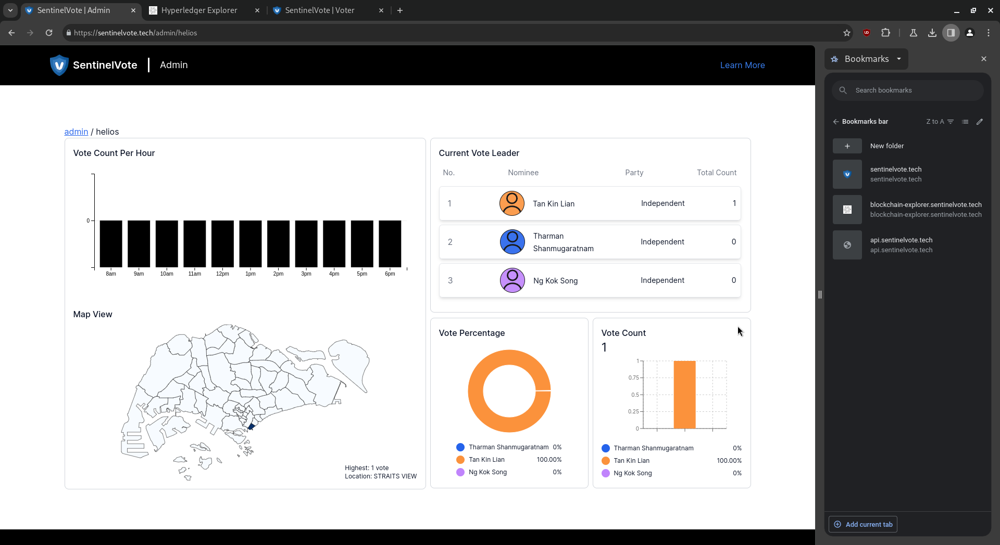

**Publish Results.**
After the election is completed, click on “Publish Results” to officially end the elections, and announce the results to the public. Click “Log out” to safely log out after announc-ing the results.
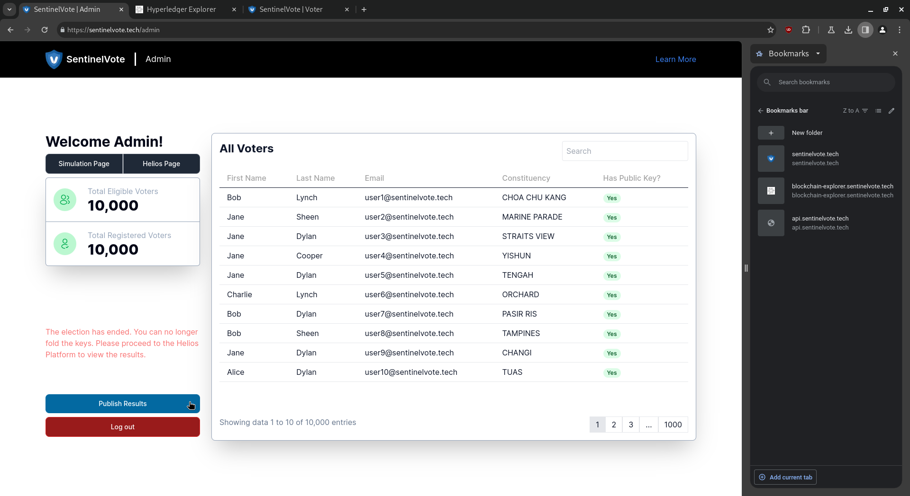

### 3. Actions performed to allow public to verify elections integrity.

**Hyperledger Explorer.**
Enter the admin’s credentials to login:
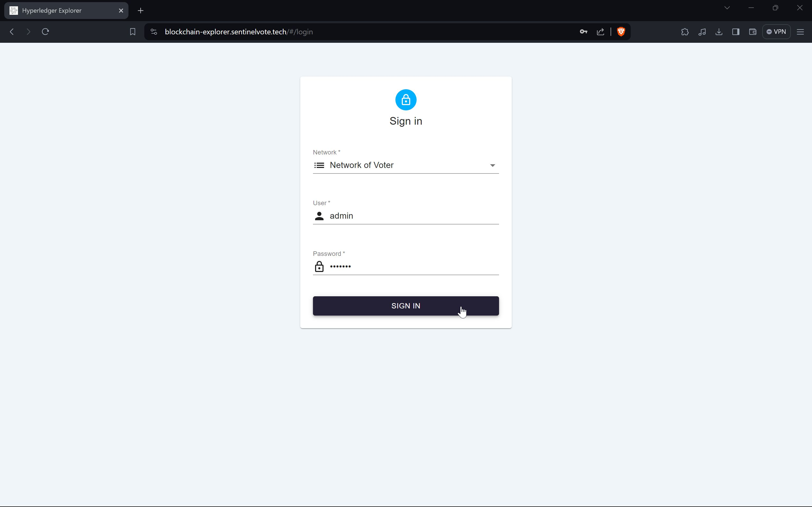

**User Management.**
Click on the “person” icon at the top right of the blockchain explorer:
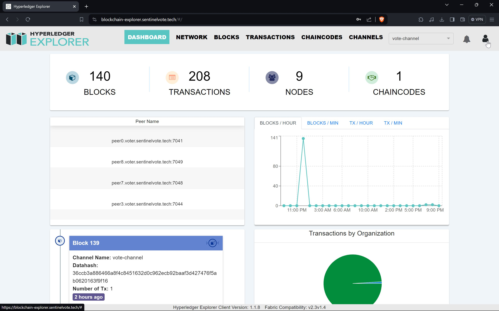
Click on the “User Management” button to open user management screen:
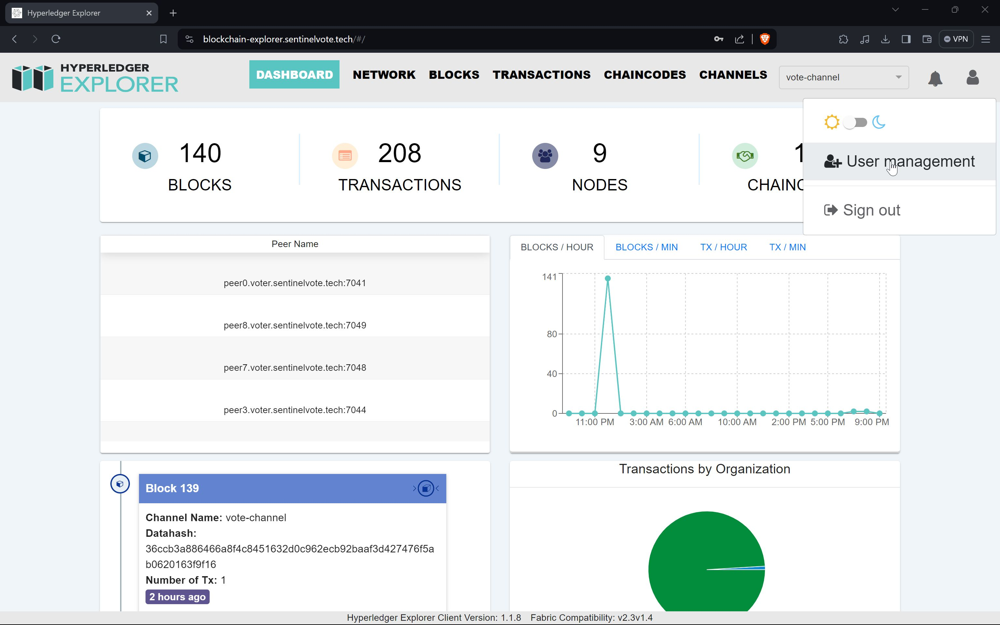

**Add public user account.**
Click on “Add User” to open up form to register new user:

Enter the required fields such as “User”, “Password”, “Password(confirm)”, and “Roles”:
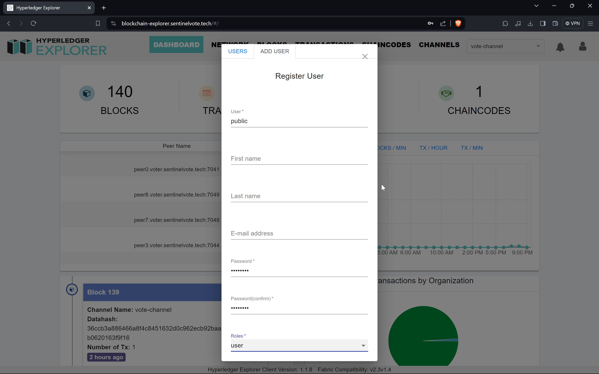
Click on the “REGISTER” button to create a public account. Upon successful comple-tion, members of the public will be able to access the blockchain explorer to view and verify the integrity of the votes:
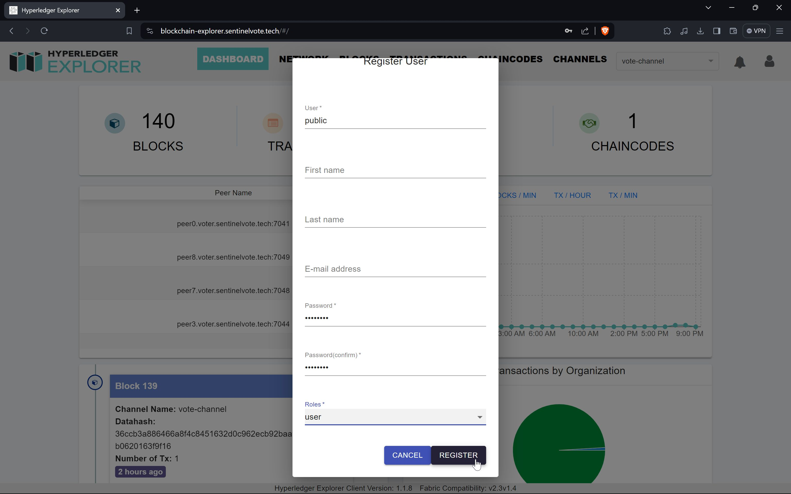

