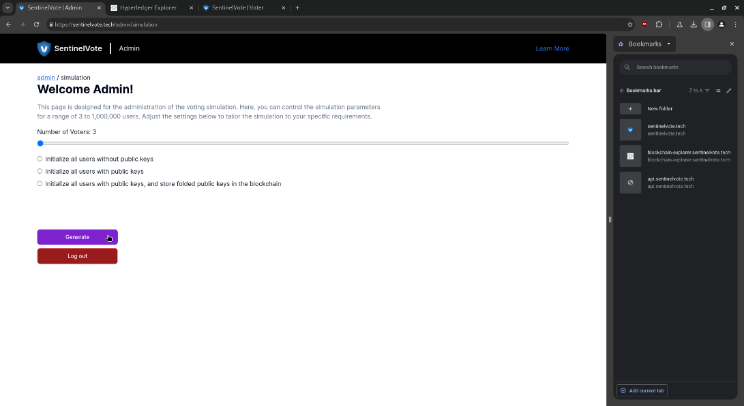
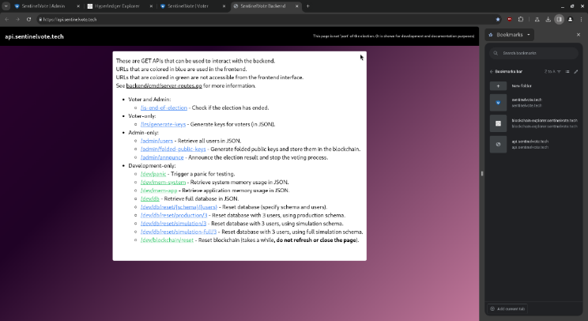

# Developer

## User Manual for Developer

### 1. Activity Simulation.

**Simulate Voting.**
Developer can setup the voting simulation by determining the number of total voters and the current voting phase:

### 2. Backend API Routes.

**Routes.**
Developer can refer to the API Routes list to understand more about the functions of each route:

