# Voter

## User Manual for Voters

### 1. Actions performed on initial login.

**Index/ Login Page:**
The login page is the default page for all users.
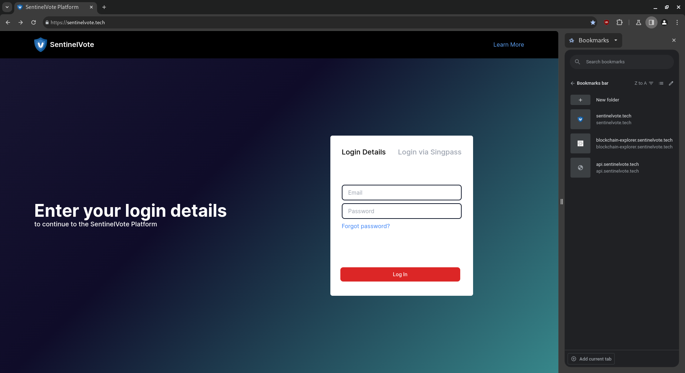

A SingPass option is also available.
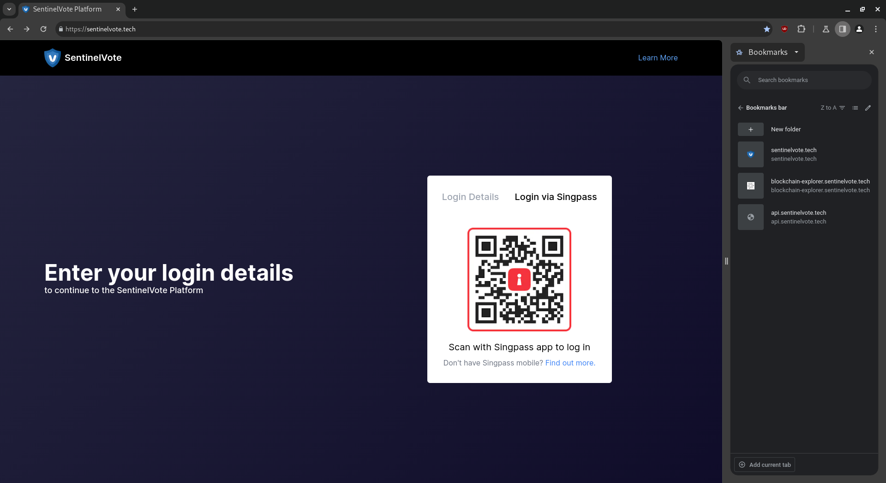

**Login:**
Fill up the email address and password and click on the “login” button.
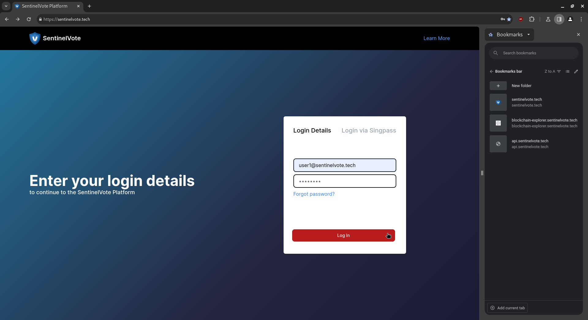

**Set Password:**
Upon initial login, voters will be required to set a new password.
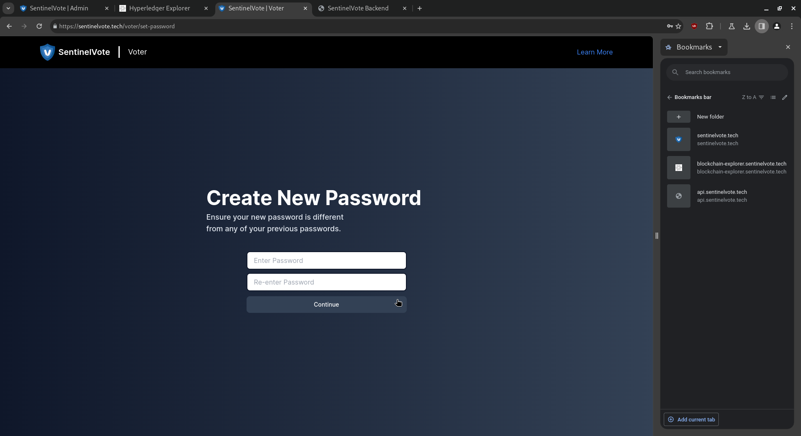

Voters will be redirected back to the login page upon successful completion.

### 2. Actions performed for Forgot Password.

**Forgot Password:**
Click on the “Forgot password” link.

**Reset Password:**
Fill up the email address to reset the password.
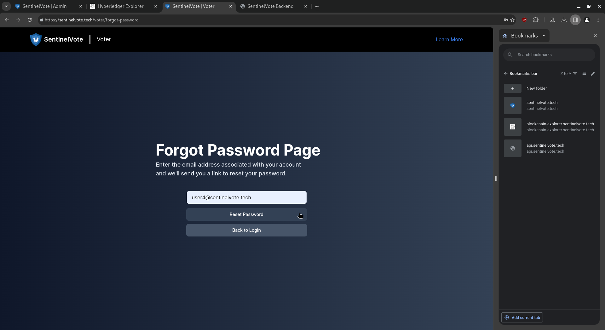
Click on the “Reset Password” button. Voters will notified of password reset.
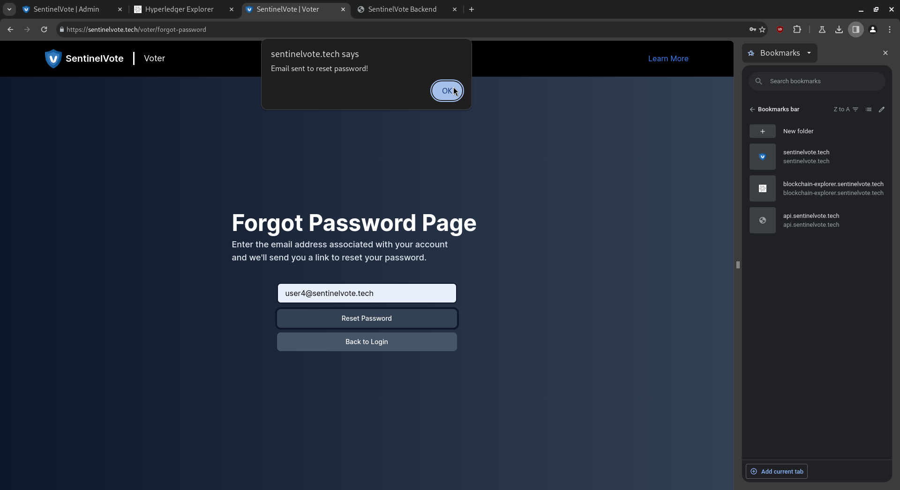
Click on the “Back to Login” button to get redirected back to the login page.

**Login:**
Fill up the email address and password and click on the “login” button.

**Set Password:**
Upon successful password reset, voters will be required to set a new password. Voters will be redirected back to the login page upon successful completion.

Voters will be redirected back to the login page upon successful completion.

### 3. Actions performed on the registration/setup phase.

**Login:**
Fill up the email address and password and click on the “login” button.
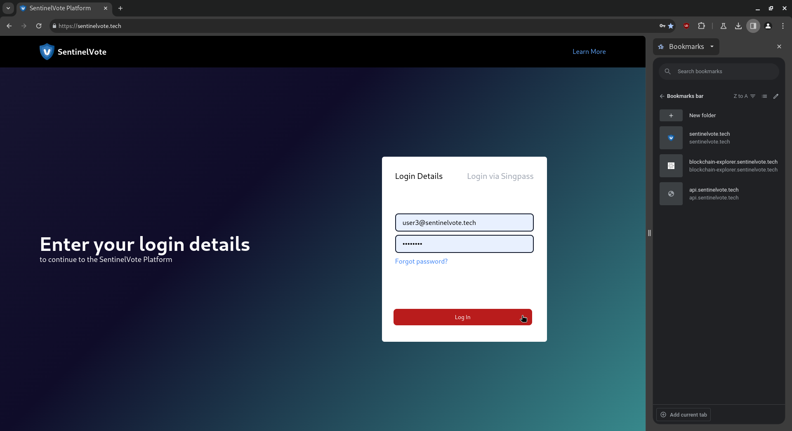

**Key Generation:**
Generate a pair of public and private keys.
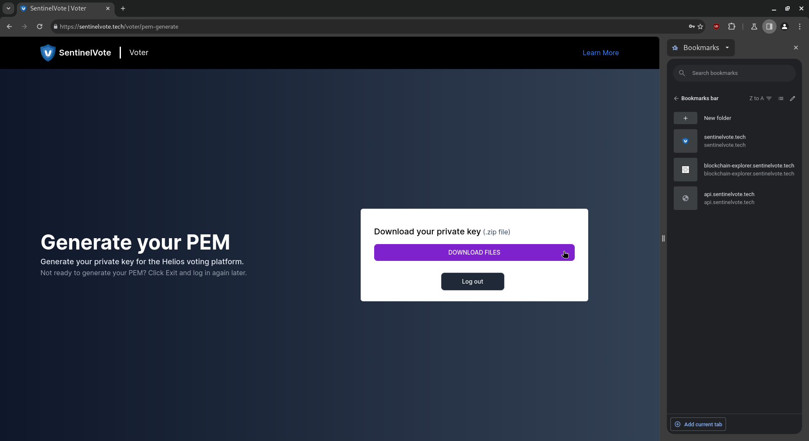
The zip file’s contents are as follows.
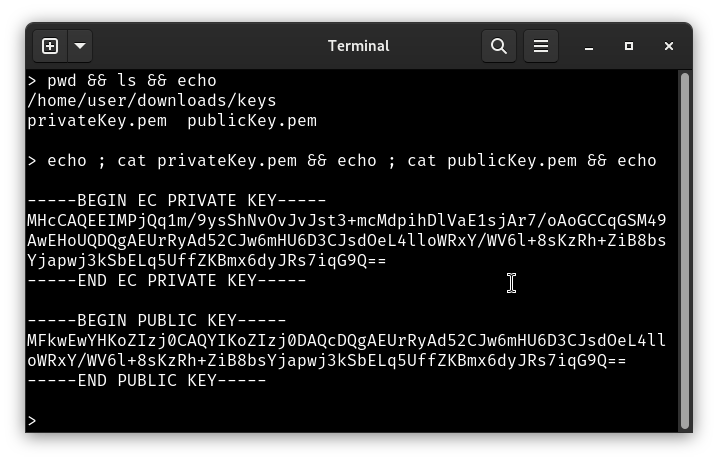

**Log Out:**
Click on the “log out” button after finish registering and wait for elections to start.

### 4. Optional actions performed prior to the voting phase.

**Login:**
Fill up the email address and password and click on the “login” button.

If the voter has their generated keys, a waiting page is displayed. Click “Log out” to log out.
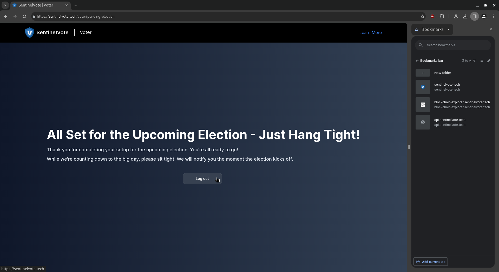

### 5. Actions performed on the voting phase.

**Login:**
Fill up the email address and password and click on the “login” button.

**Upload:**
Upload the private key that you generated earlier.

Click on “UPLOAD FILE” button to upload the private key.
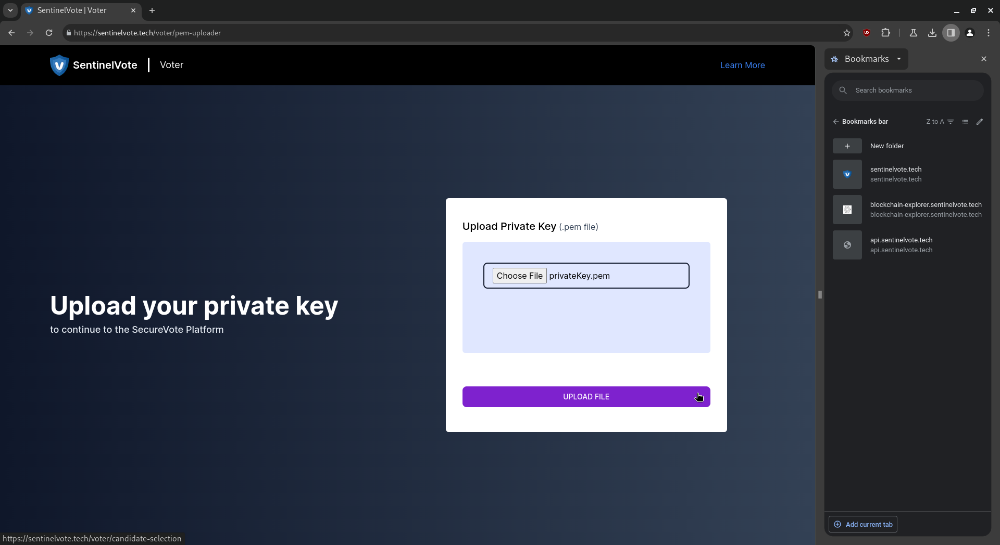

**Candidate Selection:**
Select the checkbox on the candidate you are voting for.
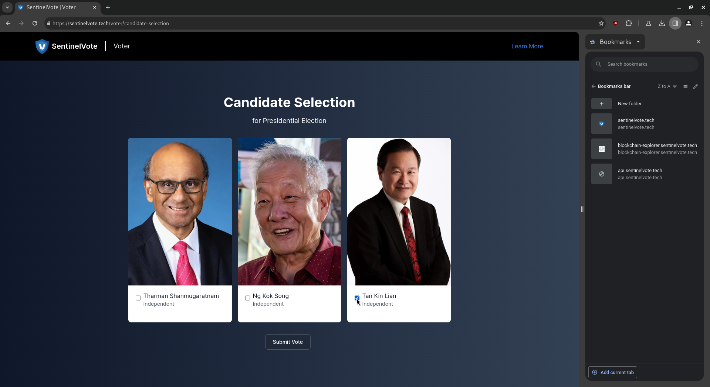
Click the “Submit Vote” button.

Click the “Confirm” button.
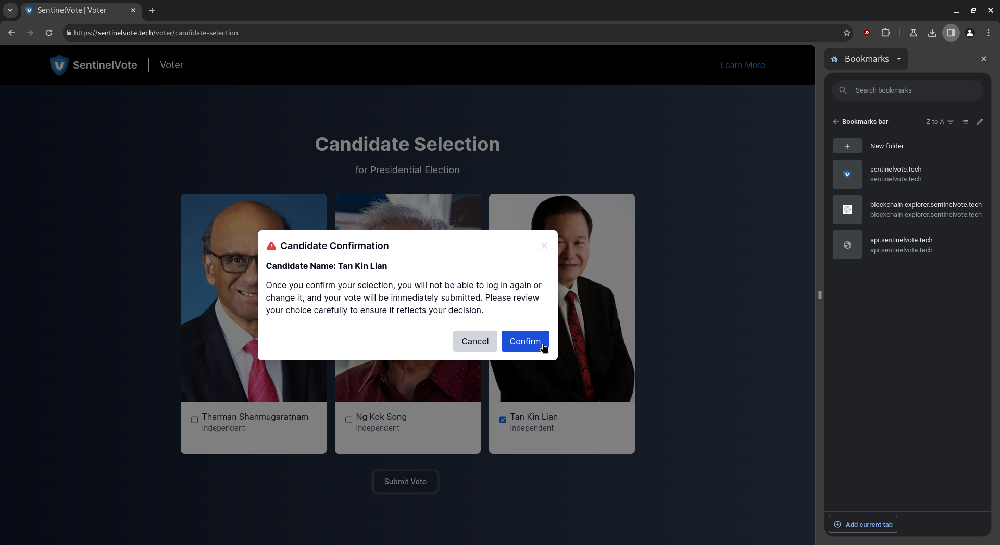
The thank you page is displayed. Click “Exit” to safely log out.

### 6. Optional actions during the voting phase (Invalid Vote).

**Upload:**
Assuming a voter has uploaded an invalid private key file:
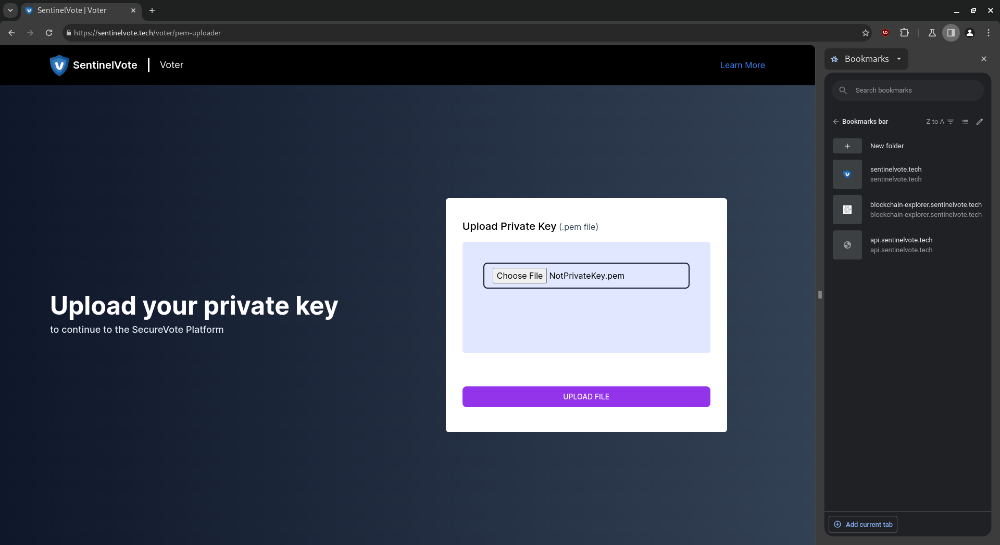

**Result:**
Clicking the “Confirm” button at the Candidate Selection Page will result in an invalid vote. This page displays a help message prompting the voter to retry the process:
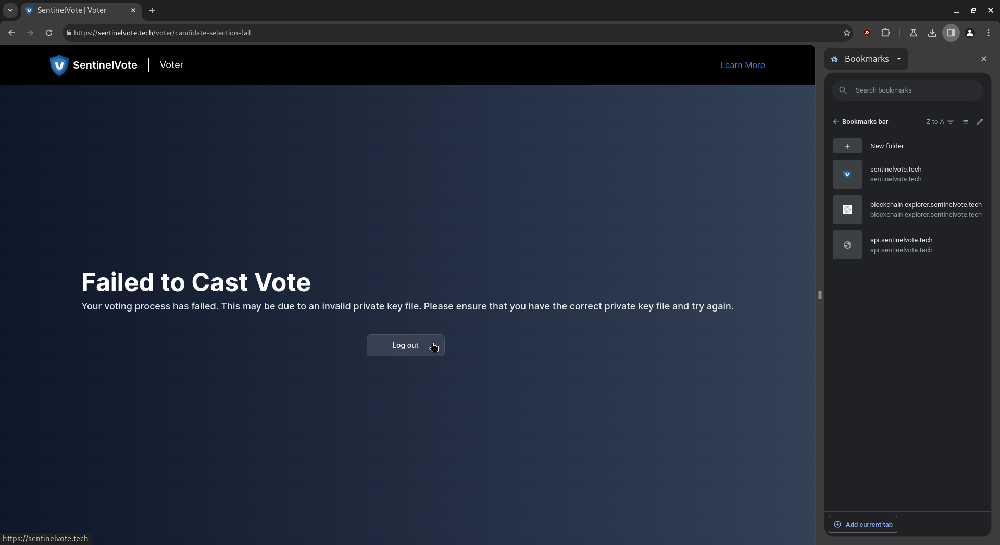

### 7. Optional actions during the voting phase (Already Voted).

**Login:**
Fill up the email address and password and click on the “login” button.

If the voter has already voted, the thank you page is displayed. Click “Exit” to safely log out.
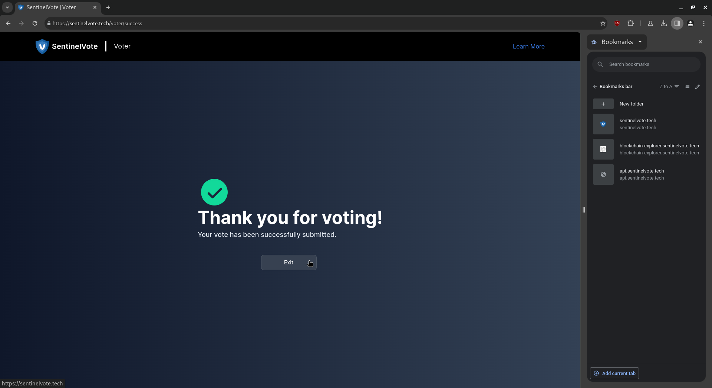

### 8. Optional actions during the voting phase (Did Not Register).

**Login:**
Fill up the email address and password and click on the “login” button.

If the voter did not register and the elections have started, the failure to vote page will be displayed. Click “Log out” to safely log out.
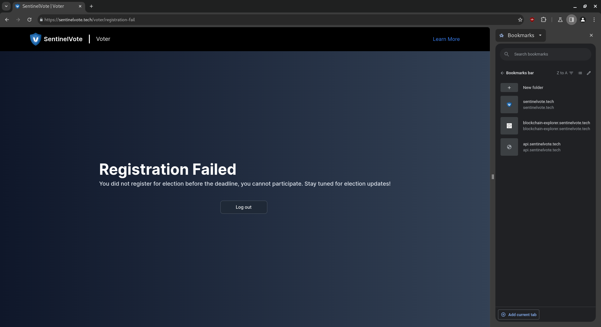

### 9. Actions performed after voting phase.

**Login:**
Fill up the email address and password and click on the “login” button.

**View Results:**
Results of the elections will be displayed. Click “Log out” to safely log out.
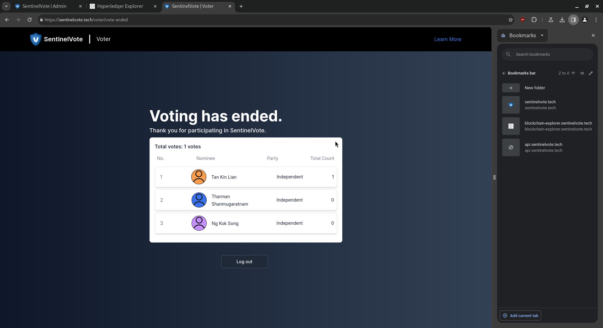

