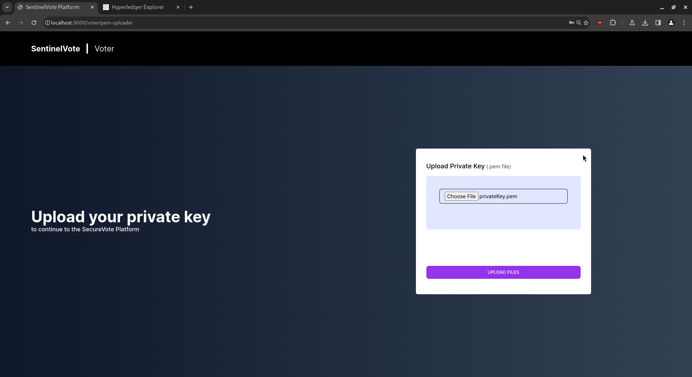
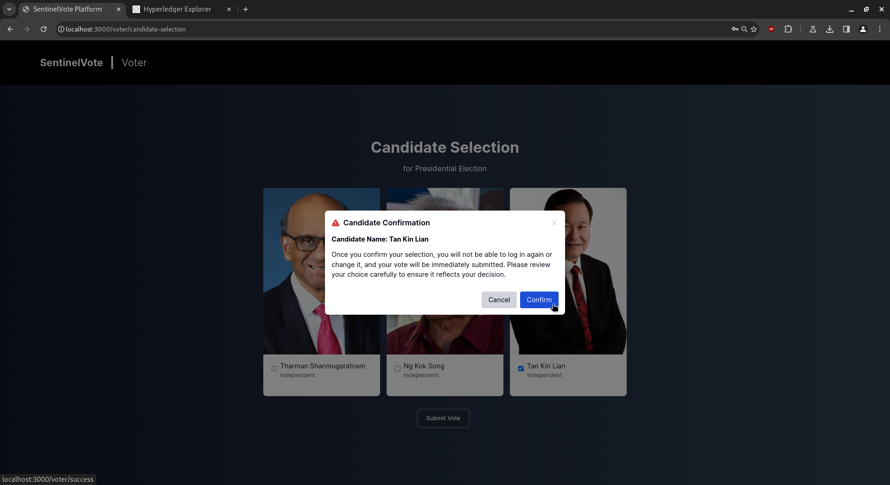
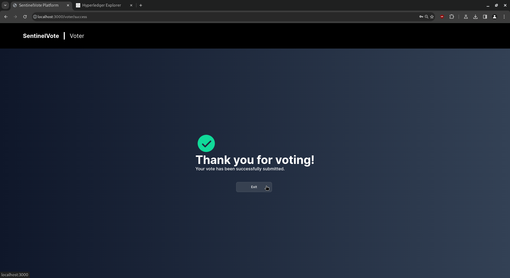

# Voter

## User Manual for Voters

### Registration/Setup Phase Actions

**1. Index / Login Page**

- Email/Password Login
  

- SingPass Login
  

**2. Login**

Fill up the email address and password, and click on the “login” button:

**3. Key Generation**

Generate a pair of public and private keys:

The zip file’s contents:

### Optional Actions Before Voting

**1. Login Again**

If the voter has their generated keys, a waiting page is displayed. Click “Exit” to log out.

### Voting Phase Actions

**1. Login Again**

Fill up the email address and password, and click on the “login” button:

**2. Upload Private Key**

Upload the private key that you generated earlier:

**3. Candidate Selection**

Select the checkbox on the candidate you are voting for:

Click the “Submit Vote” button:

Click the “Confirm” button:

The thank you page is displayed. Click “Exit” to safely log out:

